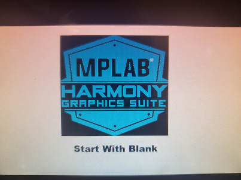

---
parent: Example Applications
title: Blank Quickstart
nav_order: 1
---

# Blank Quickstart

This application demonstrates a simple way to create and run a graphics application with a custom graphics library that directly uses the LCD controller driver.

|MPLABX Configuration|Board Configuration|
|:-------------------|:------------------|
|[blank\_qs\_a5d27\_wlsom1\_ek1\_tm5000.X](./firmware/blank_qs_a5d27_wlsom1_ek1_tm5000.X/readme.md)| [SAM A5D27 WLSOM1 EK1](https://www.microchip.com/en-us/development-tool/DM320117) using LCDC internal graphics controller to drive the [High-Performance WVGA Display Module with maXTouch® Technology](https://www.microchip.com/DevelopmentTools/ProductDetails/PartNO/AC320005-5)|
