 embedded_wizard_db_sam_a5d29_cu_tm5000.X

Defining the Architecture
-------------------------

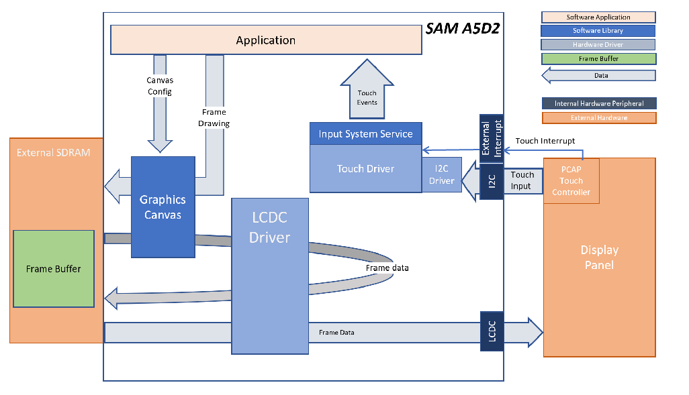

The application integrates Embedded Wizard GUI into the Harmony application. It calls directly into LCD Controller (LCDC) driver set up and initialization function calls that configure the LCDC. After LCDC initialization, Embedded Wizard GUI is initialized by a call ew_init() and the graphics application is updated with the call ew_process() periodically.
The graphics application demonstrated here is a Bezier Clock. Users can manually set the current time by touching the down arrow.
User touch input on the display panel is received through the PCAP capacitive touch controller, which sends a notification to the Touch Input Driver. The Touch Input Driver reads the touch information over I2C and sends the touch event to the Graphics Library through the Input System Service.
This application is built with GCC compiler because this application integrates the Embedded Wizard platform package compiled with GCC compiler.

### Demonstration Features

-   Graphics Acceleration using integrated display controller (LCDC)
-   Integration of Embedded wizard with Harmony application
-   Reference application for the SAMA5D29 Curiosity Board
-   18-bit color, multi-layer, WVGA (800x480) screen design
-   Time system service, timer-counter peripheral library, and driver

# Hardware Used:
1. [SAMA5D29 Curiosity development board](https://www.microchip.com/en-us/development-tool/EV07R15A)
2. [High-Performance WVGA LCD Display Module with maXTouch ® Technology](https://www.microchip.com/en-us/development-tool/ac320005-5)
3. Micro SD Card

# Software/Tools Used:
1. MPLAB® X IDE [https://www.microchip.com/en-us/tools-resources/develop/mplab-x-ide#tabs]
2. GCC Compiler [https://developer.arm.com/downloads/-/arm-gnu-toolchain-downloads] Hint: Download arm-none-eabi  
To add GCC compiler to MPLAB, go to tools , options, Embedded, Build Tools, Add the compiler.
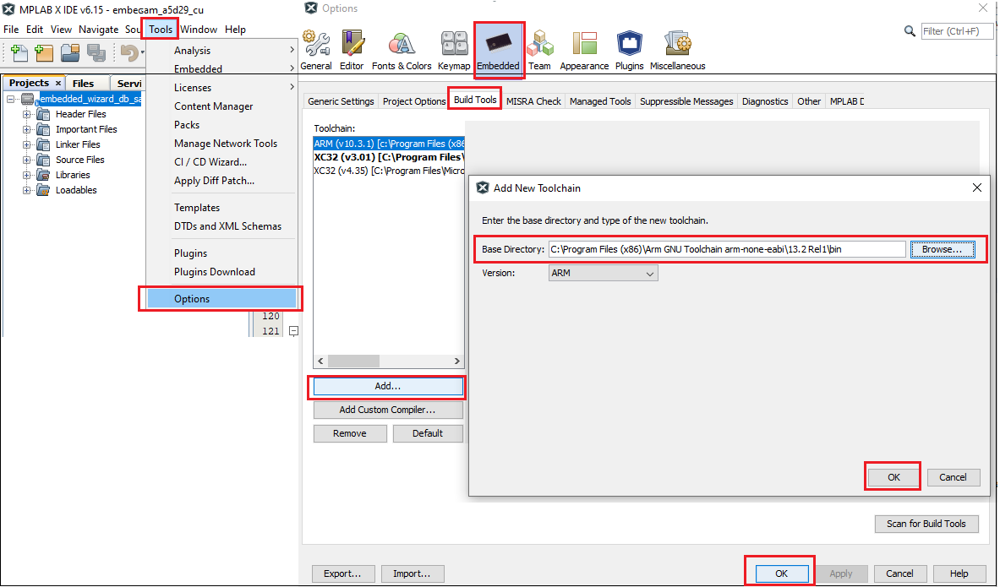

# Hardware Setup:
1. Connect the ribbon cable from the display to the J23 connector of the SAMA5D29 Curiosity Development Board.
2. Power up the board by connecting the USB cable to the USB port J1 on the SAMA5D29 curiosity development board.
3. Connect external J32 debugger to J27.
4. Connect FTDI UART debug cable to J28.

# Steps to generate Embedded Wizard Application for SAMA5D29 Curiosity
1. Link: https://doc.embedded-wizard.de/getting-started-sama5-software-drm?v=11.00

2. Follow the steps in the below snap shot from the above link and get Embedded Wizard installed in your host PC. 
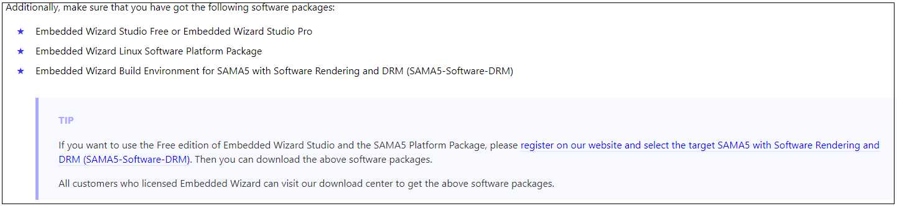 

3. Follow the steps 1-3 from the section: Installing Tools and Software in the above link. 

4. Now launch Embedded Wizard and create a new project with the below settings: 
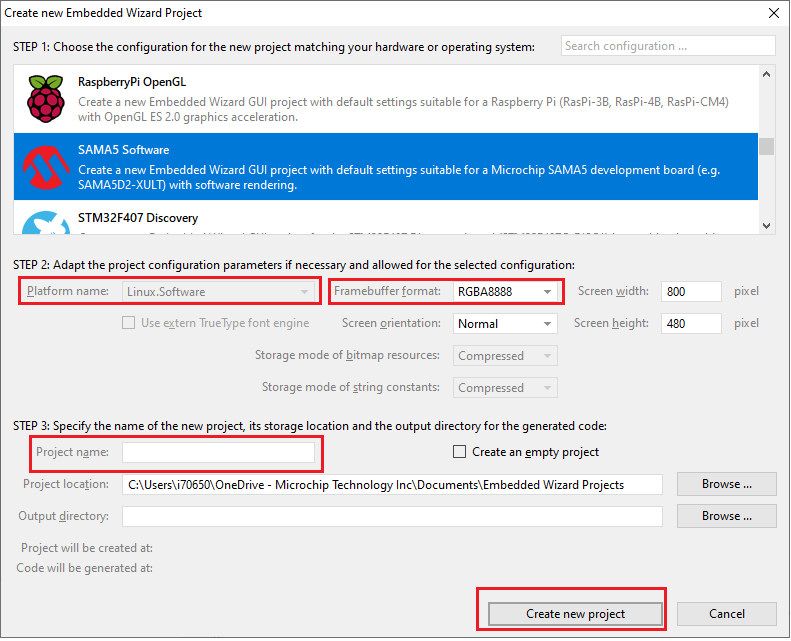 

5. Then follow steps in Creating your own UI Applications section from the above link. 
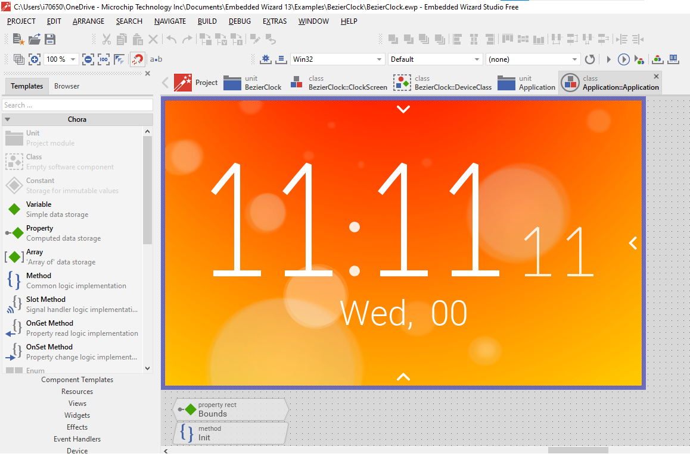 

6. After completed creating the GUI application, generate code to the directory project_folder/Embedded_Wizard/Application/GeneratedCode. 
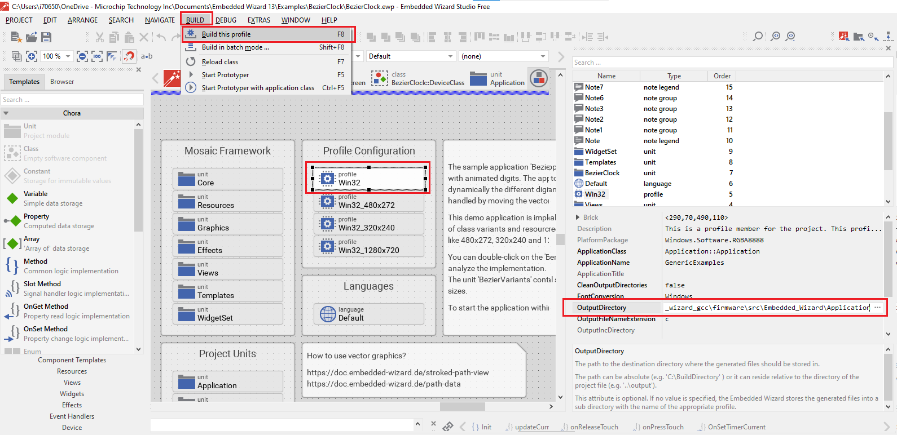 

# Creating the MPLAB Project 

1. Launch MPLAB® X IDE: Then launch Content Manager, download the optional packages gfx_apps, bsp, csp, core, gfx, dev_packs. Ignore any warning and then click Apply. Content download will take some time. Please wait till all the contents are downloaded. 
Skip this step if the framework/required packages are already available. 
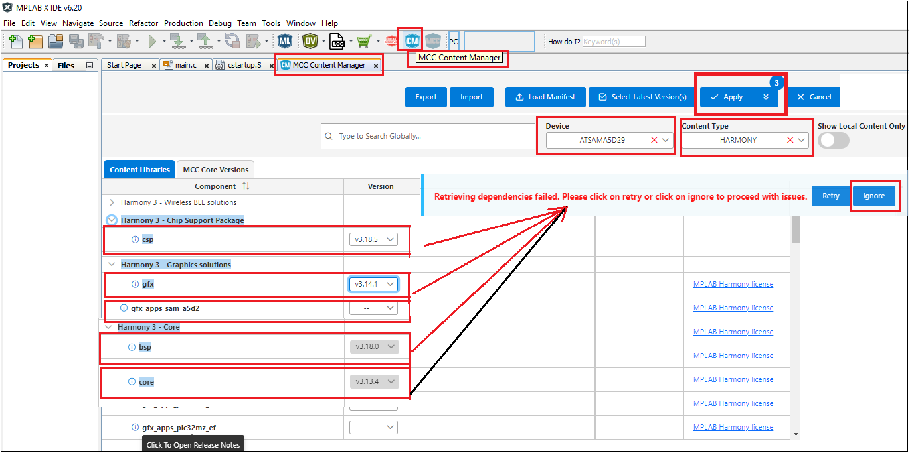 

   After the contents are downloaded, close the Content Manager tab. 

2.  From the main menu, click on File, then New Project. Under "Microchip Embedded Projects" choose Application Projects. 
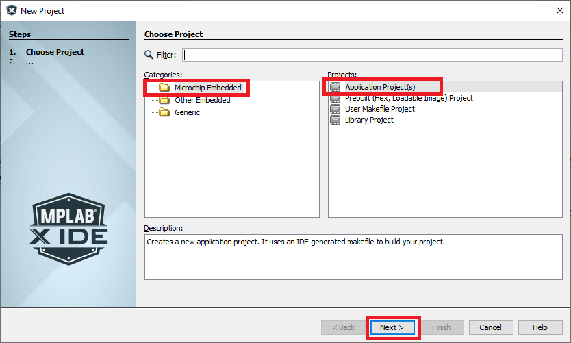  

3. In the Select Device window, for Device Family select 32bit MCUs, for Target Device select SAMA5D29. Click Next. 
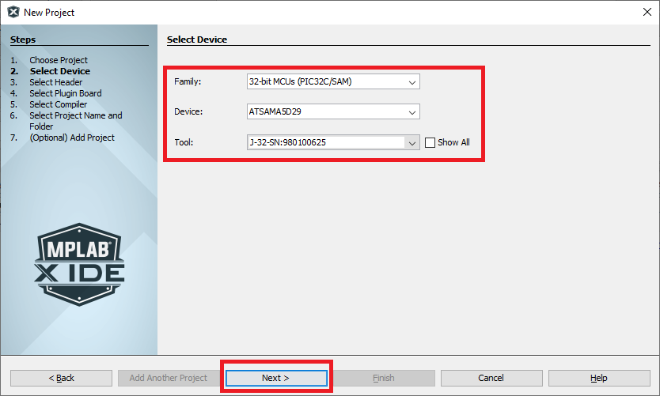 

4. In the Select Compiler window, select the gcc compiler. 
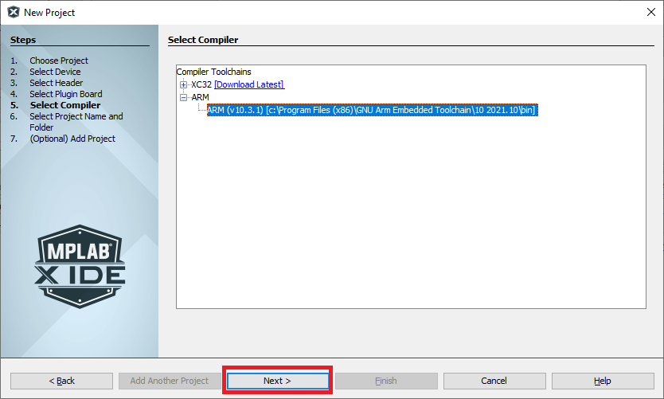

5. Enter Location , Folder and Name of the project. Select Set as Main Project and  open MCC on finish. Then click finish. 
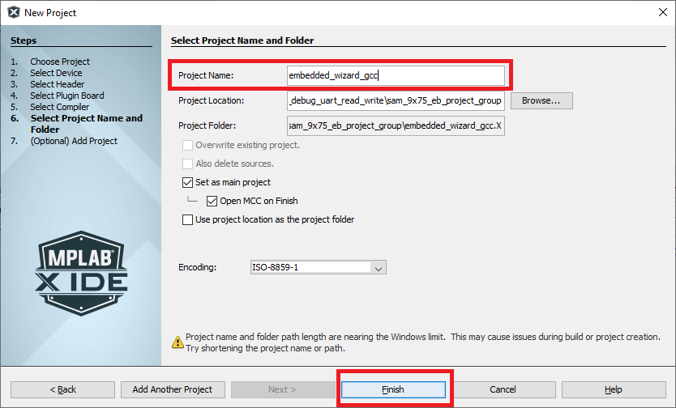 

6. This creates an empty project and set as the main project if there are other projects open in the project explorer window. 
   It will automatically launch MCC( To launch MCC manually, click MCC button in the MPLAB® X IDE tool bar). Now click Finish.  
   Note: If Mandatory Packages are already available in the host PC, this step will be skipped. 
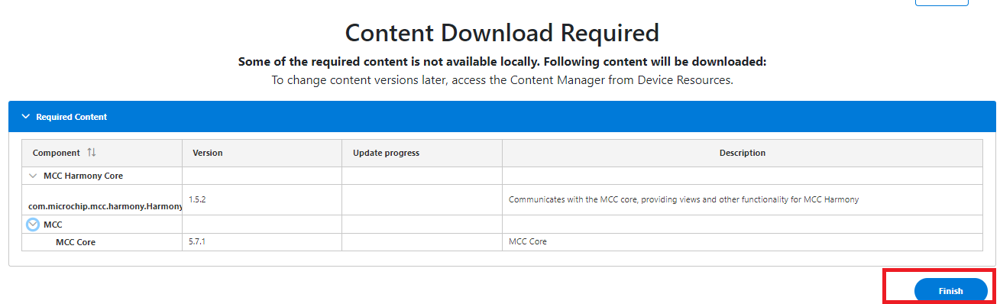 

7.Now a project graph will be displayed. From device resource add Board Support Packages for SAMA5D29 Curiosity Kit BSP to Project Graph. 
 

8.From device resource add Graphics -> Templates -> Legato Graphics w/PDA TM5000 Display to Project Graph. You will be prompted to allow auto-connection and auto-activation of several components- Click on Yes for all of them except “FreeRTOS". 
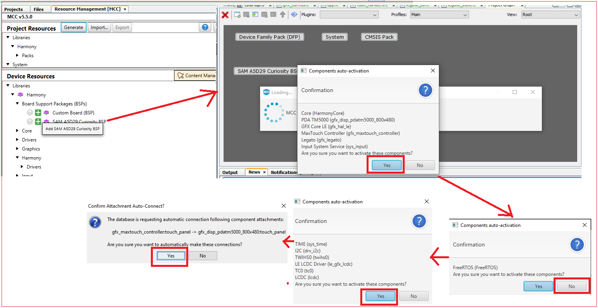 

9. Now from the project graph make the following modifications.  
   a. Remove legato by pressing the X symbol in the project graph. 
   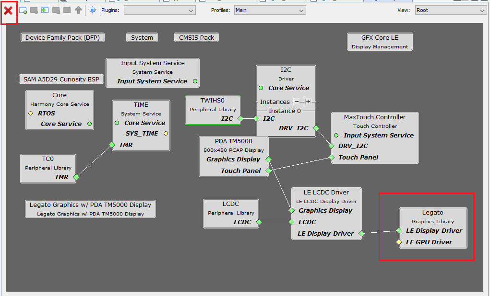 
  
   b. LE LCDC driver configuration: In the Configuration option, uncheck Overlay 1 & 2, and check Canvas Mode. This to enable single layer and enable canvas mode. 
   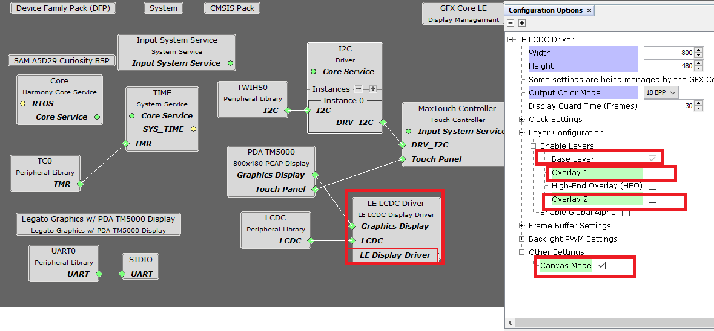 

10. Now add UART0 to the project graph , by clicking peripheral -> uart -> uart0. 
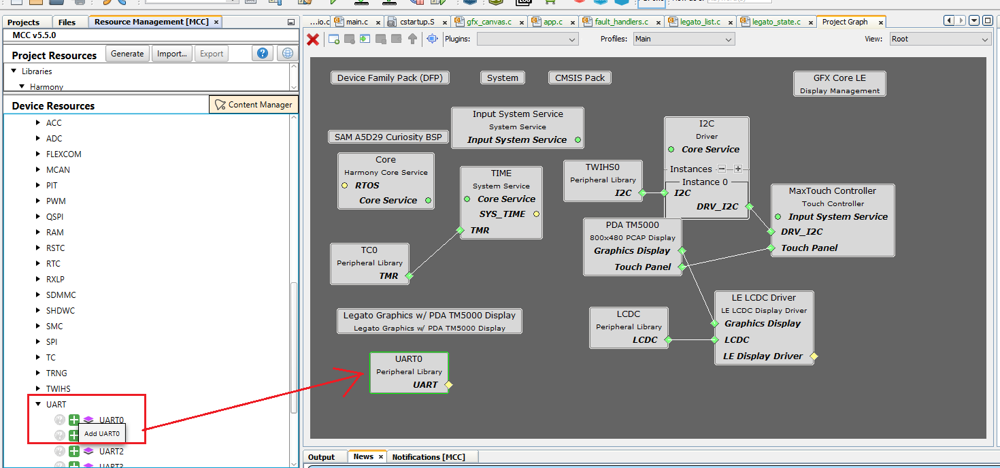 

11. Now link UART0 with the STDIO functionality by right clicking on UART0, add consumers STDIO as shown below. 
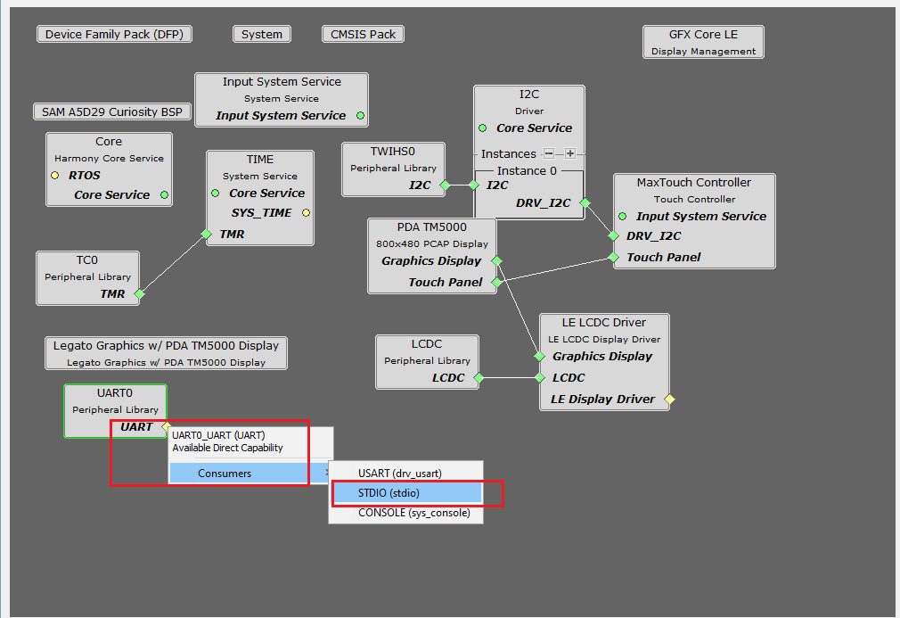 

12. The complete project graph is shown below. 
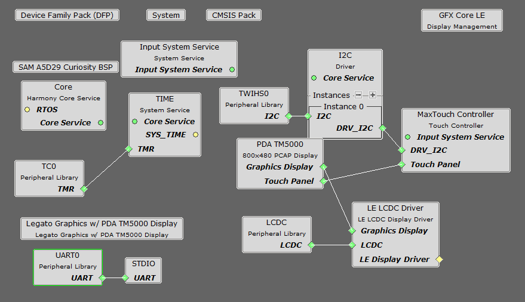 

13. Now from the project graph window, plugins menu select Pin Configuration. 
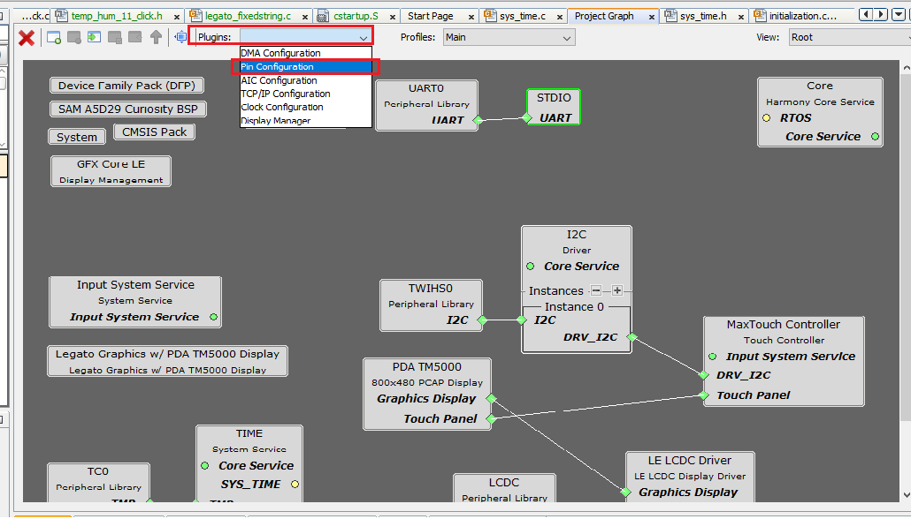 

14. Configure PB26 and PB27 for UART communication as shown below. 
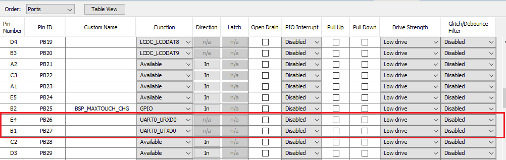 

15. Now Save all. Then click generate code. This will generate code for all the peripherals that have been added in the project graph. 
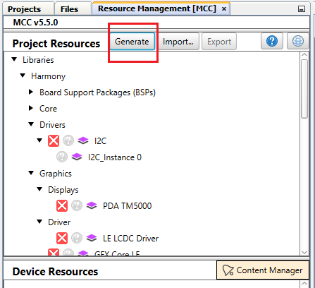 

16. Modification required to the source files.  
    a. Modify the default color mode to ARGB (#define LCDC_DEFAULT_GFX_COLOR_MODE LCDC_INPUT_COLOR_MODE_ARGB_8888) in drv_gfx_lcdc.c. 
	Note: For SAMA5D29 Curiosity, the above said color mode should be used when integrated with Embedded Wizard platform package.
    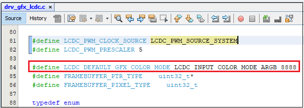 
    
    b. Replace the ddr.ld, app.c, and app.h in the project with these [app.c](../src/app.c), [app.h](../src/app.h) and [ddr.ld](../src/config/sam_a5d29_cu/ddr.ld) files. 

17. An extra section is added in the linker file to let the user know the memory area used by Embedded Wizard and it should not be used for any other purpose. 
    For the usage of the reserved Embedded Wizard memory area, refer to ewconfig.h. 
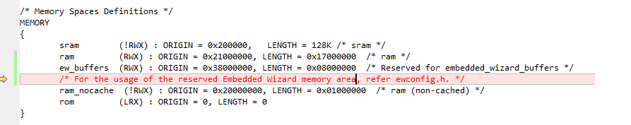 

18. Add additional linker flags and compiler flags: 
    a. Go to project, properties, Arm GCC, arm-ld, add the linker following flags, click Apply. 
       -lm -ggdb3 -mfloat-abi=hard -mfpu=neon-vfpv4 -lc -lgcc --specs=nano.specs  
       Click Generated command line to see the default linker flags. 
    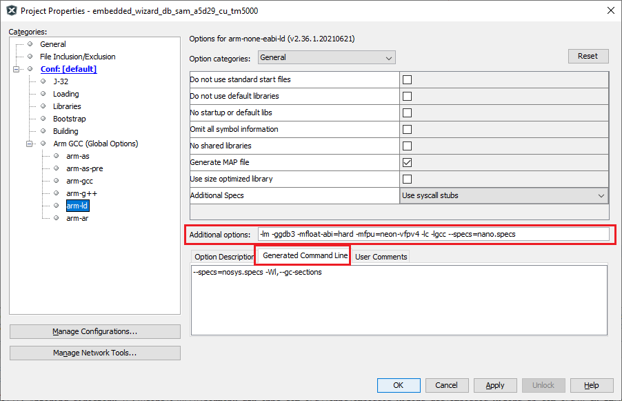 

    b. Go to project, properties, Arm GCC, arm-gcc, add the following compiler flags, click Apply. 
       -ggdb3 -mfloat-abi=hard -mfpu=neon-vfpv4  -ffunction-sections -fdata-sections -fno-common  -Wall   -mthumb -mlong-calls  
       Click Generated command line to see the default linker flags. 
   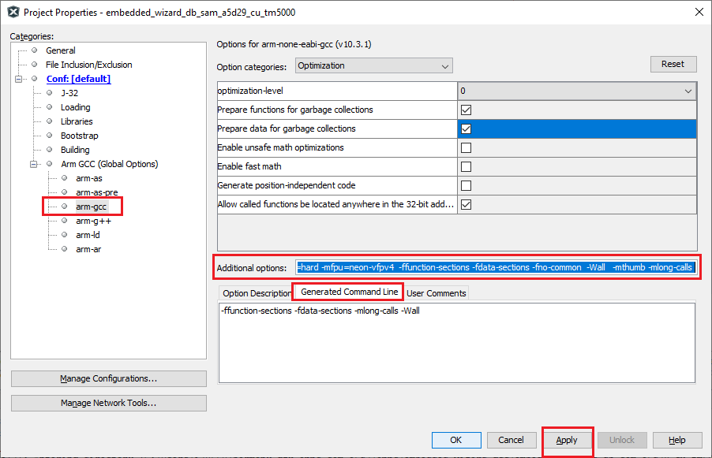 

19. Add the contents in the [Embedded wizard folder](../src/Embedded_Wizard)to the MPLAB project.  
    Embedded_Wizard folder has three folders:  
    (i)   Application(Application/GeneratedCode folder has generated source files from the section: Steps to generate Embedded Wizard Application for SAMA5D29 Curiosity)  
    (ii)  Platform Package (Source, Header and aggregate library(libewrte.a and libewgfx.a) files from Embedded Wizard Software Platform Package)  
    (iii) Target Specific (Embedded Wizard Build Environment for SAMA5D29 with Harmony integration) 

    a. Add Embedded Wizard header files from this folder:
       To do this go to project, header files, add existing items from folder, select the Embedded_Wizard folder and choose .h files in the search pane. 
       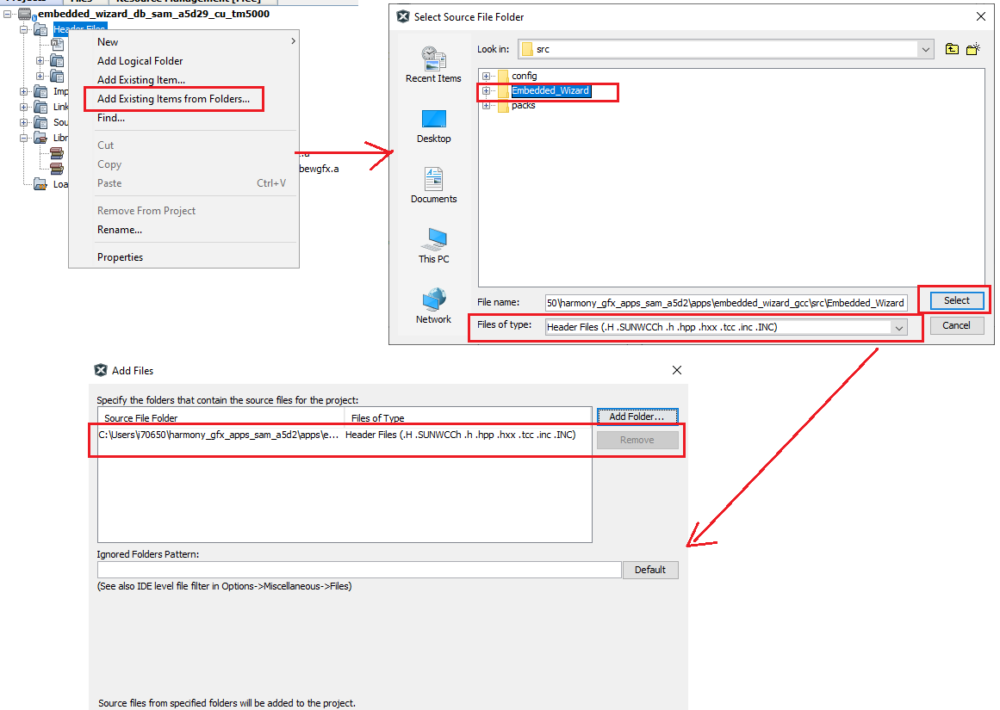 
       Similarly add the source files from this folder. To do this go to project, source files, add existing items from folder, select the Embedded_Wizard folder and choose .c files in the search pane. 
       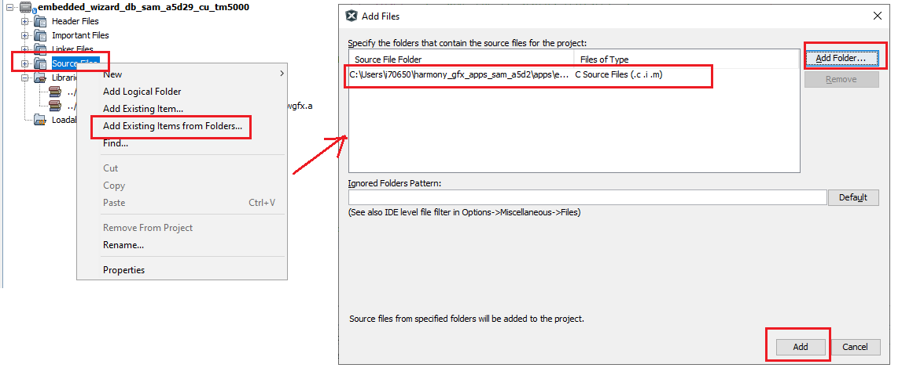 
    b. Link the Embedded Wizard EWRTE(Embedded Wizard Run Time Engine - libewrte.a) and EWGFX(Embedded Wizard Graphics - libewgfx.a) libraries go to project, libraries, add library/object file and then choose [libewrte.a](../src/Embedded_Wizard/PlatformPackage/RTE) and [libewgfx.a](../src/Embedded_Wizard/PlatformPackage/RGBA8888). 
       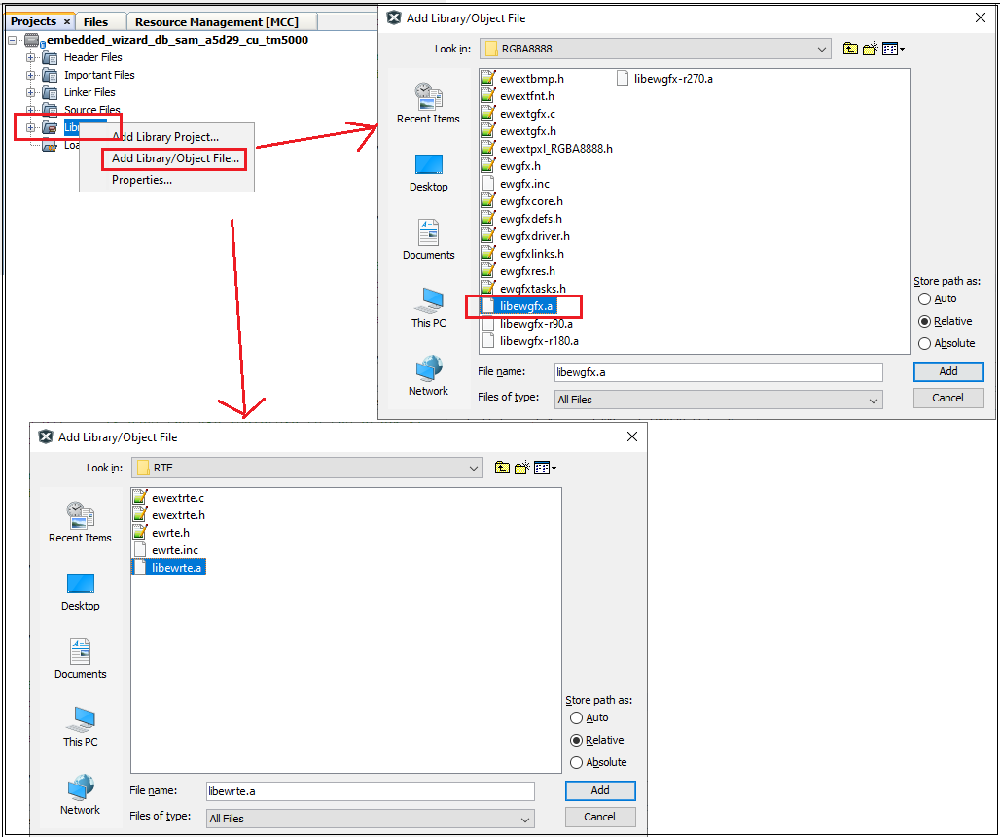 

20. If user is getting some path related error like fatal error: Unable to find devices.h, then add the include directories as shown below. 
    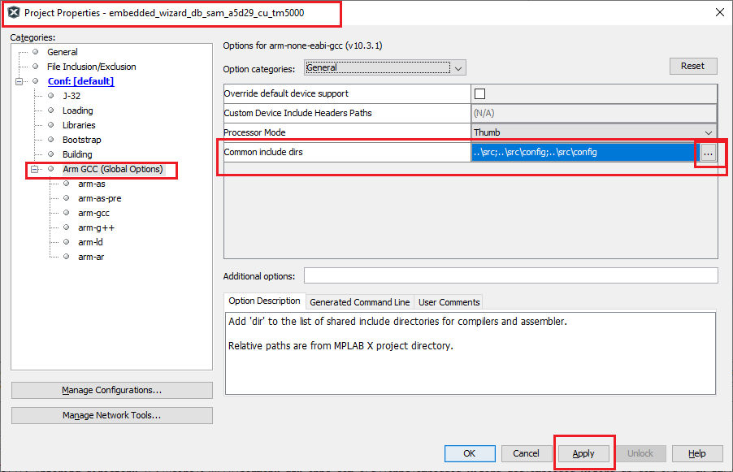 

22. To create .bin file from hex file: Use the below command in the post build option.  
    To do this project, properties, config, building, paste the below command: 
    ${MP_CC_DIR}/arm-none-eabi-objcopy -O binary ${DISTDIR}/${PROJECTNAME}.${IMAGE_TYPE}.elf ${DISTDIR}/harmony.bin 
    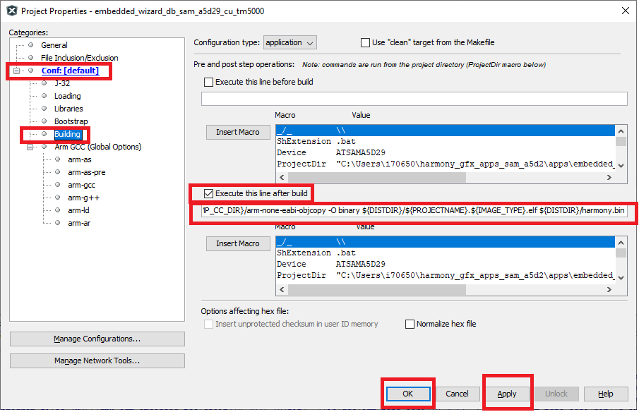 

23. Clean and build the project. You should see a message on the output tab that the project was successfully built. This completes the development of the Embedded Wizard Integrated MPLAB Harmony  pplicationfor SAMA5D29 Curisoity development board. 

# Debugging Application Project on MPLAB® X IDE: 

1. Open the project ./embedded_wizard_db_sam_a5d29_cu_tm5000.X in MPLAB® X IDE. 

2. Ensure "ATSAMA5D29" is selected as device and "J32" as hardware tool to program/debug the application. 
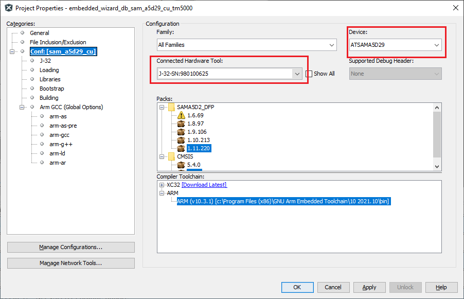 

3. Ensure at91bootstrap.elf given in the project folder is selected. 
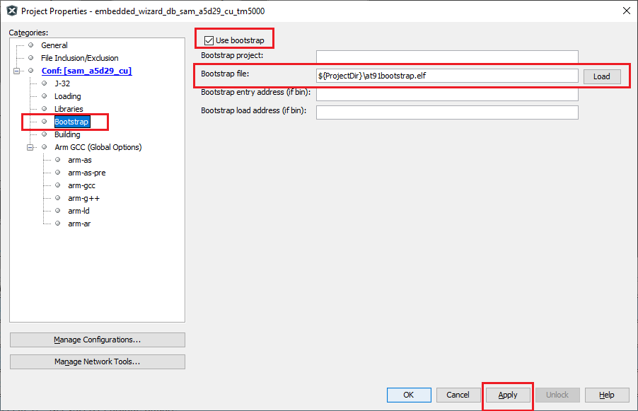 

4. J32 debug settings should be as follows: 
 

5. Build the code and Debug the code by clicking on the "Debug" button in MPLAB® X IDE tool bar. 

# Steps to boot example application from SD card 

1. Take a micro-SD Card formatted with FAT32 file system.
2. Copy the boot.bin and harmony.bin files from the [hex folder](./hex) to the micro-SD card.
3. Insert the microSD card to J6 on the SAMA5D29 Curiosity development board.
4. Reset the board.
5. The graphics application will get executed.

# FAQ:
1. Remove Extra Linker file: 
   Incase if the following error message occurred it could be because of duplicate linker file getting added to the project: 
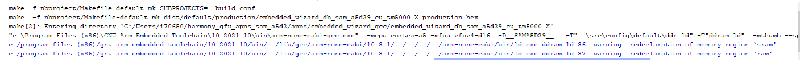 

   To remove this redundant file, do the following: 
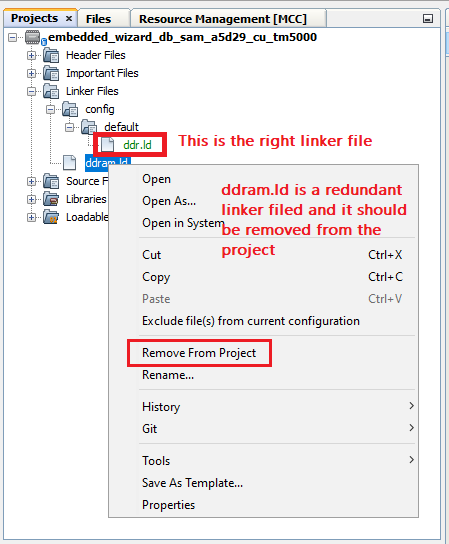 

2. Remove extra cstartup.s file: 
   Incase if the following error message occurred it could be because of duplicate startup file getting added to the project: 
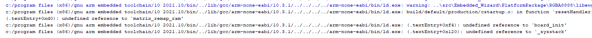 

   To remove this redundant file, do the following: 
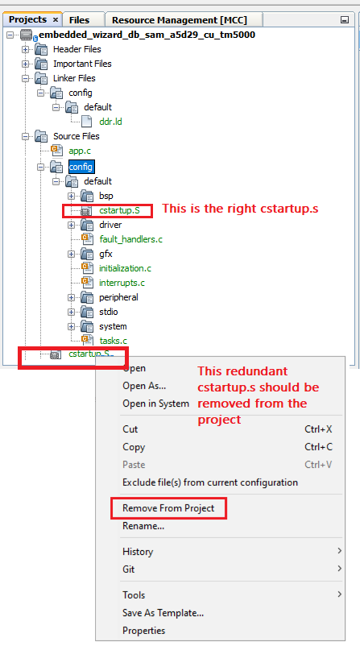 