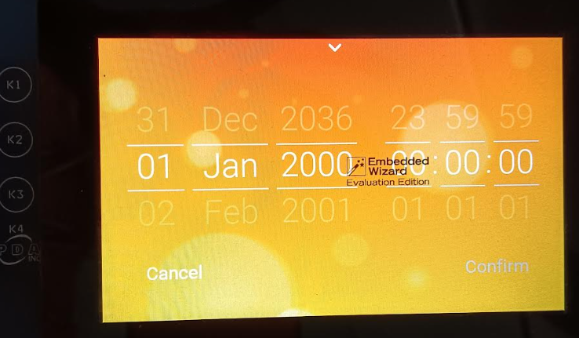

# Embedded Wizard Graphics Application using GCC Compiler

This application demonstrates a simple way to create and run a graphics application with Embedded Wizard graphics library that directly uses the LCD controller driver.

|MPLABX Configuration|Board Configuration|
|:-------------------|:------------------|
|[embedded_wizard_db_sam_a5d29_cu_tm5000.X](./firmware/embedded_wizard_db_sam_a5d29_cu_tm5000.X/readme.md)| [SAMA5D29 Curiosity Board](https://www.microchip.com/en-us/development-tool/EV07R15A) using LCDC internal graphics controller to drive the [High-Performance WVGA Display Module with maXTouch® Technology](https://www.microchip.com/DevelopmentTools/ProductDetails/PartNO/AC320005-5)|
