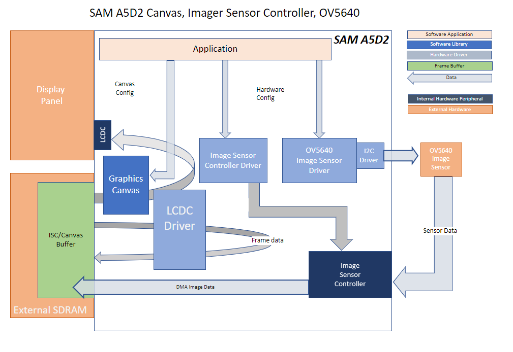
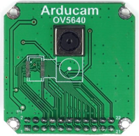
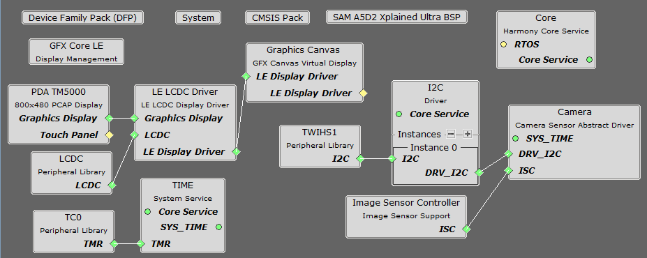
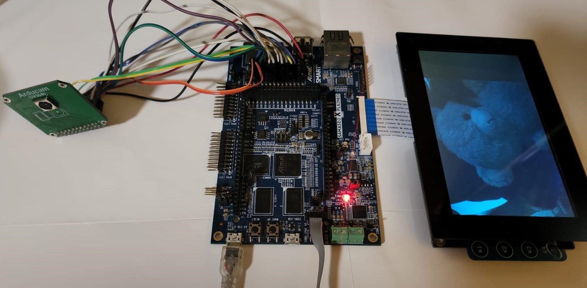

 isc\_cam\_sam\_a5d2\_xult.X

Defining the Architecture
-------------------------

This application demonstrates how to use the Image Sensor Controller peripheral with an off-the-shelf image sensor. For this example, an arducam OV5640 Camera Module is used. 

The camera module can be purchased from [this](https://www.uctronics.com/cmos-ov5640d-af-camera-module-1-4-inch-5-megapixel-module.html) link.

The application will stream the continuously captured images from the image sensor to the high performance WVGA LCD display module in VGA format. 

### Demonstration Features

-   Image Sensor Controller
-   Graphics Acceleration using integrated display controller (LCDC)
-   Graphics Canvas

Creating the Project Graph
--------------------------

The Project Graph diagram shows the Harmony components that are included in this application. Lines between components are drawn to satisfy components that depend on a capability that another component provides.

The I2C driver in this project is used for communication with the OV5640 image sensor.

The pins are configured as follows through the MHC Pin Configuration tool:

|Pin ID|Custom Name|Function|Direction|Latch|PIO Interrupt|
|:-----------|:-------|:----------|:----------|:----------|:----------|
|PB0|LED\_BLUE|LED_AL|Out|High|Disabled|
|PB5|LED\_GREEN|LED_AL|Out|High|Disabled|
|PB6|LED\_BLUE|LED\_AL|Out|High|Disabled|
|PB9|PB\_USER|SWITCH\_AL|In|Low|Disabled|
|PB11|BSP\_CAM_RESET|GPIO|Out|High|Disabled|
|PB12|BSP\_CAM_PDWN|GPIO|Out|High|Disabled|
|PB24 - PC7||ISC\_XXX|n/a|n/a|Disabled|
|PC10 - PD1||LCDC\_XXX|n/a|n/a|Disabled|
|PD4||TWIHS1_TWD1|n/a|n/a|Disabled|
|PD5||TWIHS1_TWCK1|n/a|n/a|Disabled|

The peripheral clocks need to be turned on for "ISC", "LCDC", "MPDDRC", "PIO, "TC0" and "TWIHS1". In addition, the ISC Clock should be enabled in the "ISC Clock Menu".

<b>Note:  The OV5640 image sensor is an off-the-shelf module and is not officially supported by MPLAB Harmony 3.   While a driver for this module is included as part of this demo, it is not guaranteed to be complete.  Nor are the OV5640 configuration values guaranteed to be optimal.  Consequently, the images produced by this demo may be of lower quality.  The primary purpose of this application is to demonstrate the functionality of the Image Sensor Controller module.  Additional user effort may be required to determine the most optimal camera module settings.</b>

Building the Application
------------------------

The parent directory for this application is gfx/apps/isc\_camera. To build this application, use MPLAB X IDE to open the gfx/apps/isc\_camera/firmware/isc\_cam\_sam\_a5d2\_xult.X project folder and press F11.
A successful build will generate a harmony.bin file in dist\ov5640\_mxt5000\production in the project folder.

The following table lists configuration properties:

|Project Name|BSP Used|Graphics Template Used|Description|
|:-----------|:-------|:---------------------|:----------|
|isc_cam_sam_a5d2_xult.X|SAM A5D2 Xplained Ultra|Graphics w/ PDA TM5000 Display|SAM A5D2 Xplained Ultra, 5" WVGA PCAP Touch display and OV5640 image sensor|

Configuring the Hardware
------------------------

Configure the hardware as follows:

-	The OV5640 CMOS camera module is wired to the ISC header (J18) on the SAM A5D2 Xplained Ultra using the following wiring diagram:

| Module Function | OV5640 Module Pin |  ISI Pin  | ISI Function |
|:---------------:|:-----------------:|:---------:|:------------:|
|       VCC       |      1            |     1     |    3.3 VCC   |
|       GND       |      2            |     2     |      GND     |
|       SCL       |      3            |  7 (PD05) |   TWI Clock  |
|       SDA       |      4            |  8 (PD04) |   TWI Data   |
|      VSYNC      |      5            | 12 (PC05) |     VSYNC    |
|       HREF      |      6            | 14 (PC06) |     HSYNC    |
|      PCLK       |      7            | 16 (PC04) |     PCLK     |
|      XCLK       |      8            | 10 (PC07) |     MCLK     |
|      DOUT9      |      9            | 25 (PB25) |      D7      |
|      DOUT8      |     10            | 24 (PB24) |      D6      |
|      DOUT7      |     11            | 23 (PC03) |      D5      |
|      DOUT6      |     12            | 22 (PC02) |      D4      |
|      DOUT5      |     13            | 21 (PC01) |      D3      |
|      DOUT4      |     14            | 20 (PC00) |      D2      |
|      DOUT3      |     15            | 19 (PB31) |      D1      |
|      DOUT2      |     16            | 18 (PB30) |      D0      |
|      DOUT1      |     17            |     ~     |              |
|      DOUT0      |     18            |     ~     |              |
|      RESET      |     19            |  5 (PB11) |     RESET    |
|      PWDN       |     20            |  6 (PB12) |     PWDN     |
|      AFVDD      |     21            |     ~     |      ~       |
|       STB       |     22            |     ~     |      ~       |

Note: For 8-bit YCbCr or RGB raw/565 output use D[9:2] of the sensor.

-   Connect the ribbon cable from the display to the LCD connector on the back of the SAM A5D2 Xplained Ultra board.

-   Take an SD Card formatted with FAT32 file system, and copy the boot.bin binary file from this [location](../../../boot_image/boot.bin). Also copy the harmony.bin file you generated from the "Building the Application" section.

-   Insert the SD card to J19 of the SAM A5D2 Xplained Ultra board and power up the board by connecting a powered USB cable to either J14 or J23 USB port on the SAM A5D2 Xplained Ultra board.

Running the Demonstration
-------------------------

When power-on is successful, the LCD will display the images continuously captured by the camera sensor module.

* * * * *

 
