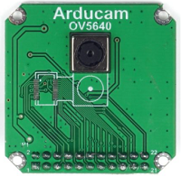

# Example Applications

The following applications are provided to demonstrate both basic and advanced Graphics capabilities of the SAM A5D2 Family.

## Legato Library Examples 

* [Legato Quickstart](./legato_quickstart/readme.md)

This demonstration provides a touch-enabled starting point for the legato graphics library.

* [Legato Dashboard](./legato_dashboard/readme.md)

This application presents a vehicle dashboard User Interface (UI). 

* [Legato Canvas Quickstart](./legato_canvas_quickstart/readme.md)

This application shows how to use Canvas with legato graphics library. 

## Blank Library Examples

* [Blank Quickstart](./blank_quickstart/readme.md)

This application demonstrates a simple way to create a graphics application using a custom graphics library that directly uses the LCD controller driver.

* [Blank Quickstart with Double Buffering](./blank_quickstart_db/readme.md)

This application demonstrates a simple way to create a graphics application using a custom graphics library that directly uses the LCD controller driver. Usage of double frame buffer is demonstrated.

* [Blank Canvas Quickstart](./blank_canvas_quickstart/readme.md)

This simple application demonstrates how to use Canvas library to display a pixel buffer with a custom graphics library using the LCD controller driver.

## Camera Examples 
* [ISC Camera](./isc_camera/readme.md)

This application uses the OV5640 arducam camera module to demonstrate the Image Sensor Controller interface in the SAMA5D2 Xplained target board.

