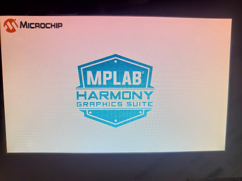

# Blank Canvas Quickstart

This application demonstrates a simple way to create and run a graphics application with a custom graphics library that directly uses the LCD controller driver. It also shows how to use the Canvas Graphics library. Touching anywhere on the LCD swaps the display image between the two pictures shown above.

|MPLABX Configuration|Board Configuration|
|:-------------------|:------------------|
|[blank\_cqs\_a5d27\_wlsom1\_ek1\_tm5000.X](./firmware/blank_cqs_a5d27_wlsom1_ek1_tm5000.X/readme.md)| [SAM A5D27 WLSOM1 EK1](https://www.microchip.com/en-us/development-tool/DM320117) using LCDC internal graphics controller to drive the [High-Performance WVGA Display Module with maXTouch® Technology](https://www.microchip.com/DevelopmentTools/ProductDetails/PartNO/AC320005-5)|
|[blank\_cqs\_a5d27\_som1\_ek1\_tm5000.X](./firmware/blank_cqs_a5d27_som1_ek1_tm5000.X/readme.md)| [SAM A5D27 SOM1 EK1](https://www.microchip.com/en-us/development-tool/atsama5d27-som1-ek1) using LCDC internal graphics controller to drive the [High-Performance WVGA Display Module with maXTouch® Technology](https://www.microchip.com/DevelopmentTools/ProductDetails/PartNO/AC320005-5)|
|[blank\_cqs\_a5d29\_cu\_tm5000.X](./firmware/blank_cqs_a5d29_cu_tm5000.X/readme.md)| [SAM A5D29 CURIOSITY](https://www.microchip.com/en-us/development-tool/ev07r15a) using LCDC internal graphics controller to drive the [High-Performance WVGA Display Module with maXTouch® Technology](https://www.microchip.com/DevelopmentTools/ProductDetails/PartNO/AC320005-5)|

