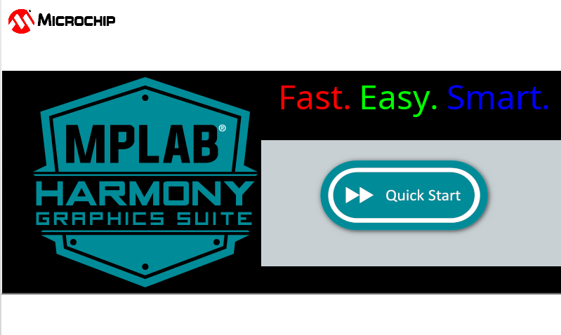

# Legato Canvas Quickstart

This application shows how to use Canvas with Legato graphics library. A black rectangle is displayed with a logo and some fonts in layer one. This screen can be moved around with a swipe gesture using Canvas. Layer two has a grey panel with a button. Pressing the button moves the black rectangle back to home position.  

|MPLABX Configuration|Board Configuration|
|:-------------------|:------------------|
|[legato\_cqs\_a5d27\_wlsom1\_ek1\_tm5000.X](./firmware/legato_cqs_a5d27_wlsom1_ek1_tm5000.X/readme.md)|[SAM A5D27 WLSOM1 EK1](https://www.microchip.com/en-us/development-tool/DM320117) using LCDC internal graphics controller to drive the [High-Performance WVGA Display Module with maXTouch® Technology](https://www.microchip.com/DevelopmentTools/ProductDetails/PartNO/AC320005-5)|
|[legato\_cqs\_a5d29\_cu\_tm5000.X](./firmware/legato_cqs_a5d29_cu_tm5000.X/readme.md)|[SAM A5D29 CURIOSITY](https://www.microchip.com/en-us/development-tool/ev07r15a) using LCDC internal graphics controller to drive the [High-Performance WVGA Display Module with maXTouch® Technology](https://www.microchip.com/DevelopmentTools/ProductDetails/PartNO/AC320005-5)|
