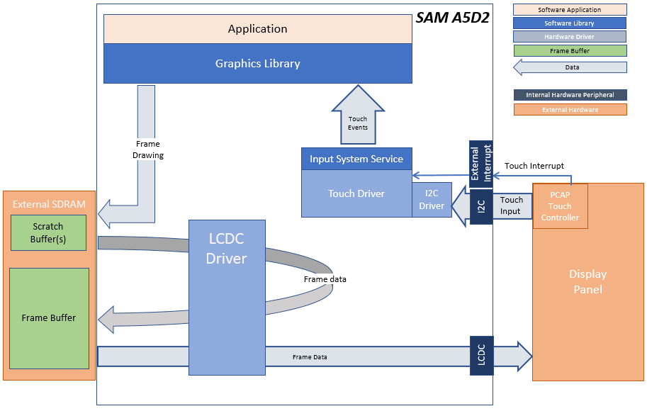
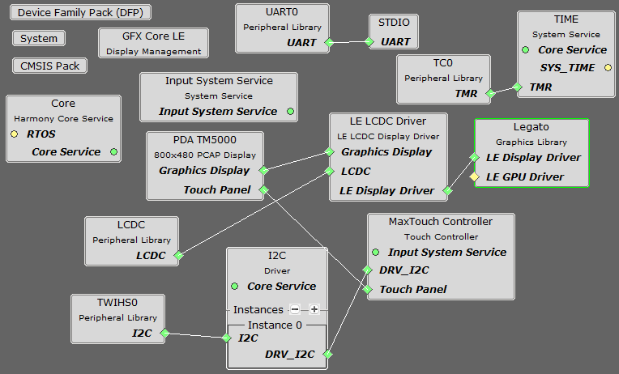
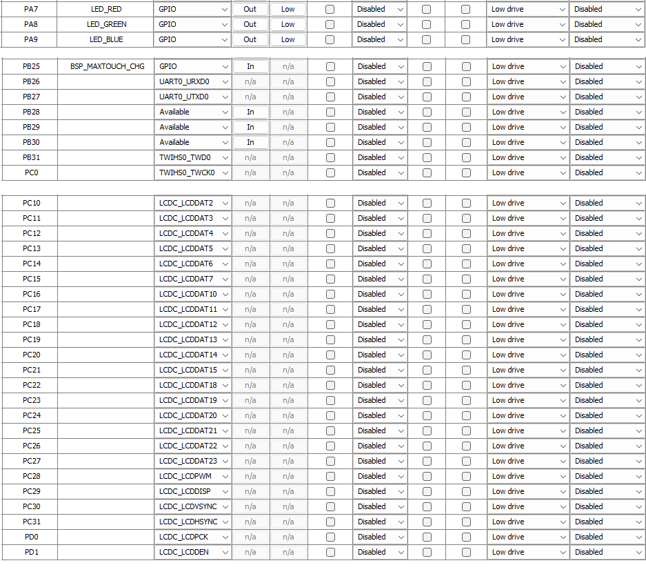

 legato\_qs\_a5d29\_cu\_tm5000.X

Defining the Architecture
-------------------------

This application demonstrates multi-layer WVGA graphics using SDRAM memory.

User touch input on the display panel is received thru the PCAP capacitive touch controller, which sends a notification to the Touch Input Driver. The Touch Input Driver reads the touch information over I2C and sends the touch event to the Graphics Library thru the Input System Service.

### Demonstration Features

-   Legato Graphics Library
-   Reference application for the SAMA5D29-Curiosity board 
-   24-bit color, multi-layer, WVGA (800x480) screen design
-   Time system service, timer-counter peripheral library and driver
-   Graphics Acceleration using integrated display controller (LCDC)
-   I2C and touch controller driver

Creating the Project Graph
--------------------------

The Project Graph diagram shows the Harmony components that are included in this application. Lines between components are drawn to satisfy components that depend on a capability that another component provides.
The pin configurations are set as shown below.

Peripheral clocks for LCDC, MPDDRC, PIO, TC0, TWIHS0& UART0 must be enabled from System-> Clock -> Peripheral Clock Menu.
Interrupts must be enabled for TWI0, TC0, and LCDC.

Building the Application
------------------------

The parent directory for this application is gfx/apps/legato\_quickstart. To build this application, use MPLAB X IDE to open the gfx/apps/legato\_quickstart/firmware/legato\_qs\_a5d29\_cu\_tm5000.X project folder and press F11. 

A successful build will generate a harmony.bin file in dist/lcdc_rgba8888_mxt_a5d29_cu_wvga/production inside the project folder.

> \*\*\_NOTE:\_\*\* This application may contain custom code that is marked by the comments // START OF CUSTOM CODE ... and // END OF CUSTOM CODE. When using the MPLAB Harmony Configurator to regenerate the application code, use the "ALL" merging strategy and do not remove or replace the custom code.

Configuring the Hardware
------------------------

Configure the hardware as follows:

-   Connect the ribbon cable from the display to the LCD connector J23 on the SAMA5D29-Curiosity board.

> \*\*\_NOTE:\_\*\* The LCD ribbon cable should have contacts on the top side.

-   Take an SD Card formatted with FAT32 file system, and copy the boot.bin binary file from this [location](bootstrap/curiosity/boot.bin). Also copy the harmony.bin file you generated from the "Building the Application" section.

-   Insert the SD card into J7 on the SAMA5D29-Curiosity board and power up the board by connecting a powered USB cable to the USB port J1 on the board or 5V DC power supplied to J2.

Running the Demonstration
-------------------------

When power-on is successful, the demonstration will display a menu similar to the one shown in the following figure (different configurations may have slight variation in the screen aspect ratio):

* * * * *

 
